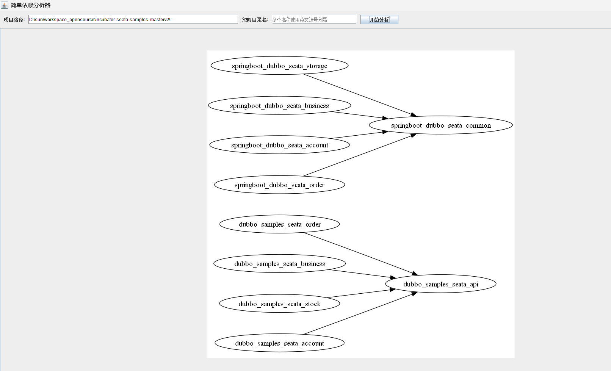
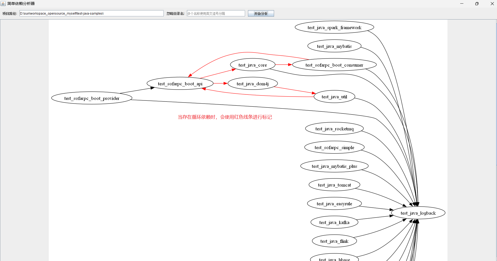

# README

## 需求

当项目模块很多时（超过20+），它们之间的显示依赖关系如果不精心维护，很容易出现循环依赖的情况；而且，多个模块之间的依赖关系会影响到它们的构建顺序。  
本人在实际项目中遇到的场景是：基础工程维护了30+个Maven模块，而且模块之间存在依赖引用的情况。这些模块一共有6个人共同维护，时不时就会出现因为模块引用不当导致升级版本的时候打包失败的问题，所以每次推包到Maven仓库之前都需要人肉梳理一次模块之间的依赖关系，并整理出各个模块的打包顺序，非常痛苦。  

该工具的目的就是快速分析Maven项目各个模块之间的依赖关系，并通过图形化方式展示出它们之间依赖的先后顺序关系。  
对于存在循环依赖的情况，使用颜色进行明确标注。  

## 使用

有两种方式运行该程序：
1. 通过java命令行执行，格式：`java -jar simple-dependency-analyzer-0.0.1-SNAPSHOT-jar-with-dependencies.jar <需要分析的项目绝对路径> [需要忽略的目录名，以英文逗号分隔]`。  
```shell
# 不设置忽略的目录名
java -jar simple-dependency-analyzer-0.0.1-SNAPSHOT-jar-with-dependencies.jar D:\sun\workspace\test-java-samples

# 设置需要忽略的目录名
java -jar simple-dependency-analyzer-0.0.1-SNAPSHOT-jar-with-dependencies.jar D:\sun\workspace\test-java-samples mac,boar
```  

2. 启动图形化界面  

## 依赖

本工具依赖[Graphviz](https://graphviz.org/), 在运行之前必须先安装相应操作系统平台对应的Graphviz。  
同时，还需要安装Java 8+运行时环境。


## 示例

展示模块之间的依赖关系：不存在循环依赖。



展示模块之间的依赖关系：存在循环依赖时通过线条颜色进行标记。



【参考】
[十分钟学会graphviz画图](https://www.jianshu.com/p/6d9bbbbf38b1)

